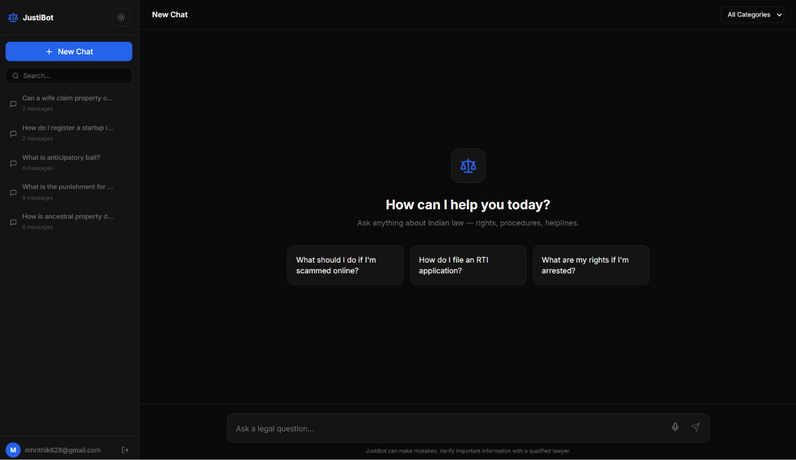
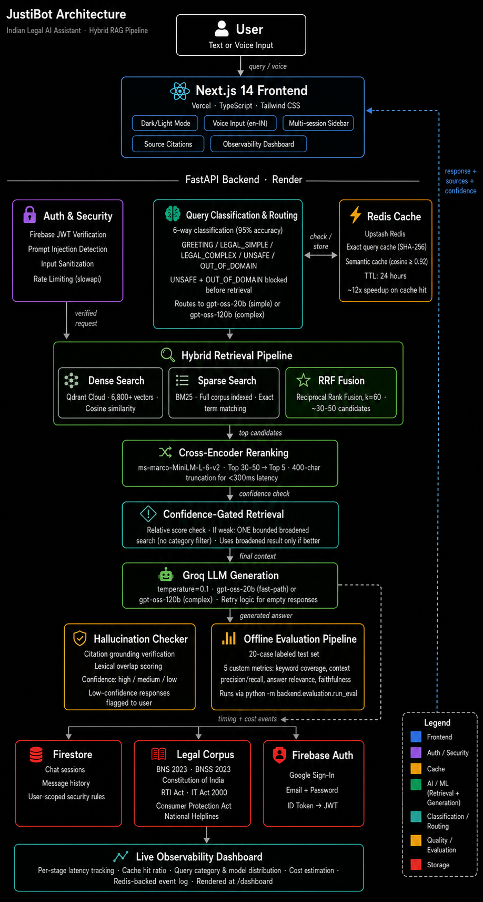

# ⚖️ JustiBot — Indian Legal Assistant

An AI-powered legal chatbot that helps Indian citizens understand their rights, laws, and legal procedures — grounded in official Indian legal documents with zero hallucination tolerance.


**3,400+ legal vectors · Semantic caching · Firebase Auth · Voice input · Source citations**

---

## 🖥️ Dashboard Preview

<p align="center">
  
</p>

---

## 🏗️ Architecture

<p align="center">
  
</p>

### Request Flow

1. User submits a text or voice query.
2. Firebase JWT is verified by the FastAPI backend.
3. Input is sanitized and checked for prompt injection attempts.
4. Redis checks exact and semantic caches.
5. Query is embedded using sentence-transformers.
6. Qdrant retrieves relevant legal context.
7. Groq generates a grounded response using retrieved documents.
8. Chat history is persisted in Firestore.
9. Sources and citations are returned to the frontend.

---

## ✨ Key Features

### 📚 Retrieval-Augmented Generation (RAG)

Every answer is grounded in official Indian legal documents.

* Context retrieved from vector search
* Source citations attached to responses
* Relevance scores displayed
* Direct links to source documents

### ⚡ Semantic Caching

Two-level cache powered by Upstash Redis.

* Exact query cache
* Semantic similarity cache (0.92 threshold)
* ~12× faster repeated queries
* Reduced LLM costs

### 🎯 Zero-Hallucination Design

Built for legal accuracy.

* Low-temperature generation (`0.1`)
* Retrieval-first architecture
* Citation enforcement
* Explicit uncertainty handling

### 🔒 Security

* Firebase JWT verification
* Prompt injection detection
* Input sanitization
* Firestore access controls
* Per-user data isolation

### 🎙️ Voice Input

Indian-English speech recognition using the Web Speech API.

### 💬 Multi-Session Chat

* Persistent chat history
* Searchable sessions
* Editable titles
* Sidebar navigation

---

## 📖 Legal Corpus

All documents are sourced directly from official Indian government portals.

| Document                                | Category           |
| --------------------------------------- | ------------------ |
| Bharatiya Nyaya Sanhita 2023            | Criminal Law       |
| Bharatiya Nagarik Suraksha Sanhita 2023 | Procedural Law     |
| Constitution of India                   | Constitutional Law |
| RTI Act 2005                            | Civil Law          |
| Consumer Protection Act 2019            | Consumer Law       |
| Information Technology Act 2000         | Cyber Law          |
| National Cyber Crime Portal             | Cyber Law          |

**Corpus Size:** 3,419 vectorized chunks from 7 official legal sources.

---

## 🛠️ Tech Stack

| Layer           | Technology                           |
| --------------- | ------------------------------------ |
| Frontend        | Next.js 14, TypeScript, Tailwind CSS |
| Backend         | FastAPI, Python 3.11                 |
| Authentication  | Firebase Auth                        |
| Vector Database | Qdrant Cloud                         |
| Embeddings      | all-MiniLM-L6-v2 (384 dimensions)    |
| LLM             | Groq API                             |
| Cache           | Upstash Redis                        |
| Persistence     | Cloud Firestore                      |
| Deployment      | Vercel + Render                      |

---

## 📂 Project Structure

```text
justibot/
│
├── backend/
│   ├── corpus/
│   ├── middleware/
│   ├── routers/
│   ├── services/
│   ├── main.py
│   └── Dockerfile
│
├── frontend/
│   ├── app/
│   ├── components/
│   ├── lib/
│   └── types/
│
├── firestore.rules
└── README.md
```

---

## 🚀 Local Setup

### Prerequisites

* Python 3.11+
* Node.js 18+
* Docker
* Qdrant Cloud account
* Groq API key
* Firebase project
* Upstash Redis instance

---

### Backend

```bash
cd backend

python -m venv venv

# Windows
venv\Scripts\activate

# Linux / Mac
source venv/bin/activate

pip install -r requirements.txt

cp .env.example .env
```

Populate `.env` with API credentials.

#### One-Time Corpus Ingestion

```bash
python -m backend.corpus.ingest
```

#### Run Backend

```bash
uvicorn backend.main:app --reload
```

Backend:
http://localhost:8000

API Docs:
http://localhost:8000/docs

---

### Frontend

```bash
cd frontend

npm install

cp .env.local.example .env.local

npm run dev
```

Frontend:
http://localhost:3000

---

## 🔌 API Endpoints

| Method | Endpoint                         | Auth |
| ------ | -------------------------------- | ---- |
| GET    | /api/health                      | No   |
| GET    | /api/health/detailed             | Yes  |
| POST   | /api/chat                        | Yes  |
| GET    | /api/chat/sessions               | Yes  |
| GET    | /api/chat/sessions/{id}/messages | Yes  |
| DELETE | /api/chat/sessions/{id}          | Yes  |
| PATCH  | /api/chat/sessions/{id}/title    | Yes  |

---

## 🐳 Docker

```bash
cd backend

docker build -t justibot-backend .

docker run \
-p 8000:8000 \
--env-file .env \
justibot-backend
```

---

## 🚀 Deployment

### Frontend (Vercel)

```bash
cd frontend
npx vercel --prod
```

### Backend (Render)

* Connect GitHub repository
* Root directory: `backend`
* Build command:

```bash
pip install -r requirements.txt
```

* Start command:

```bash
uvicorn backend.main:app --host 0.0.0.0 --port $PORT
```

* Add environment variables from `.env.example`

---

## ⚠️ Disclaimer

JustiBot provides legal information for educational purposes only and is **not a substitute for professional legal advice**.

Always consult a qualified legal professional for case-specific guidance.

Information is generated using official legal documents available at the time of corpus ingestion and may not reflect the latest amendments.

---

Built for Indian citizens 🇮🇳 using modern AI, RAG, and open-source technologies.
