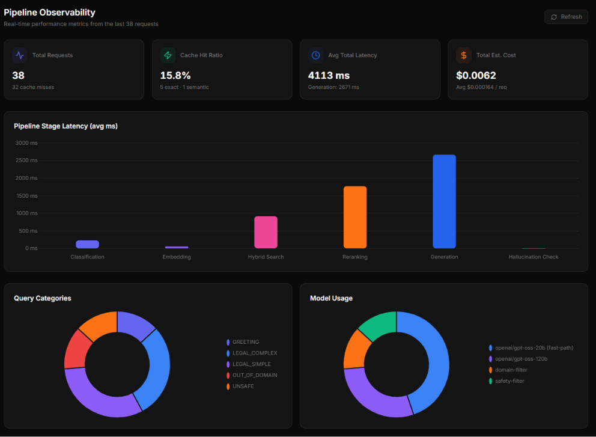

# JustiBot — Indian Legal Assistant

An AI-powered legal chatbot that helps Indian citizens understand their rights, laws, and legal procedures — grounded in official Indian legal documents with zero hallucination tolerance.


**3,400+ legal vectors · Hybrid retrieval + reranking · Query-routed
LLM inference · Hallucination detection · Semantic caching · Live
observability dashboard**

---

## JustiBot Preview

<p align="center">
  
</p>

---

## Architecture

<p align="center">
  
</p>

### Request Flow

1. User submits a text or voice query.
2. Firebase JWT is verified by the FastAPI backend; input is
   sanitized and checked for prompt injection.
3. **Query is classified** into GREETING / LEGAL_SIMPLE /
   LEGAL_COMPLEX / UNSAFE / OUT_OF_DOMAIN (95% classification
   accuracy on a labeled test set). UNSAFE and OUT_OF_DOMAIN
   queries are short-circuited immediately — no retrieval or
   generation occurs.
4. Redis checks exact and semantic caches; a cache hit returns
   immediately.
5. **Hybrid retrieval** runs dense vector search (Qdrant) and
   sparse BM25 search in parallel, fused via Reciprocal Rank
   Fusion (RRF).
6. **Cross-encoder reranking** narrows ~30-50 fused candidates
   down to the top 5 most relevant chunks.
7. **Confidence-gated retrieval**: if the reranked results show
   weak relative separation (a flat score distribution — a signal
   the topic may not be well-covered by the corpus), a single
   bounded broadened search runs across the full corpus with no
   category filter, and is used only if it produces a better result.
8. The query is **routed to one of two LLMs** based on
   classification — `openai/gpt-oss-20b` for simple queries,
   `openai/gpt-oss-120b` for complex legal reasoning — generating
   a grounded response at low temperature (0.1).
9. A **hallucination check** verifies that citations in the answer
   are actually grounded in the retrieved context, and computes a
   lexical-overlap-based confidence score (high / medium / low).
   Low-confidence responses are visibly flagged to the user.
10. Chat history is persisted in Firestore.
11. Every stage is timed and logged to an **observability pipeline**
    (Redis-backed), surfaced on a live dashboard.
12. Sources, citations, and confidence metadata are returned to
    the frontend.

---

## Key Features

###  Retrieval-Augmented Generation (RAG)

Every answer is grounded in official Indian legal documents.

* Context retrieved from vector search
* Source citations attached to responses
* Relevance scores displayed
* Direct links to source documents

###  Semantic Caching

Two-level cache powered by Upstash Redis.

* Exact query cache
* Semantic similarity cache (0.92 threshold)
* ~12× faster repeated queries
* Reduced LLM costs

###  Zero-Hallucination Design

Built for legal accuracy.

* Low-temperature generation (`0.1`)
* Retrieval-first architecture
* Citation enforcement
* Explicit uncertainty handling

###  Security

* Firebase JWT verification
* Prompt injection detection
* Input sanitization
* Firestore access controls
* Per-user data isolation

###  Voice Input

Indian-English speech recognition using the Web Speech API.

###  Multi-Session Chat

* Persistent chat history
* Searchable sessions
* Editable titles
* Sidebar navigation

---

## Advanced RAG Pipeline

JustiBot goes beyond a standard single-pass RAG setup. The
retrieval and generation pipeline was built and iteratively
hardened across 6 phases, each validated against real test cases
and logged failure modes.

### Hybrid Retrieval (Dense + Sparse + Fusion)

* Dense search via Qdrant (semantic similarity)
* Sparse search via BM25 (exact keyword/term matching — critical
  for legal text where exact section numbers and act names matter)
* Results fused using Reciprocal Rank Fusion (RRF, k=60)
* Full corpus (6,838 chunks after re-ingestion) indexed for BM25
  at startup via Qdrant scroll export

### Cross-Encoder Reranking

* `cross-encoder/ms-marco-MiniLM-L-6-v2` reranks the top ~30-50
  fused candidates down to the 5 most relevant
* Candidate text truncated to 400 characters before scoring to
  keep CPU inference latency under ~300ms
* **Known limitation, investigated and documented**: the
  cross-encoder is trained on conversational web search snippets
  (MS MARCO), which systematically compresses its absolute
  confidence scores on formal legislative text. Root-caused via a
  controlled experiment (best-possible in-corpus match for a
  direct RTI Act query scored only ~0.01 after sigmoid
  normalization). Fixed by switching `is_retrieval_weak()` from an
  absolute score threshold to a relative score-separation check —
  and validated that the downstream hallucination checker (a
  differently-calibrated signal) still correctly discriminates
  in-corpus from out-of-corpus content regardless.

### Query Classification & Cost-Optimized LLM Routing

* Every query is classified into one of 6 categories using a fast
  Groq call before any retrieval happens
* UNSAFE and OUT_OF_DOMAIN queries are blocked/redirected
  immediately — zero retrieval or generation cost
* Simple queries route to `openai/gpt-oss-20b` (faster, cheaper);
  complex multi-part legal questions route to `openai/gpt-oss-120b`
* Classification accuracy improved from 45% to 95% during
  development by diagnosing a zero-shot prompt ambiguity (the
  classifier didn't recognize BNS/BNSS as valid Indian law terms)
  and fixing it with corpus-aware context injection and few-shot
  examples — validated via the evaluation pipeline below

### Hallucination Detection

* Every generated answer is checked for citation grounding: does
  each cited Act/Section actually appear in the retrieved context?
* Lexical overlap between the answer and retrieved context provides
  a secondary groundedness signal
* Responses are tagged `high` / `medium` / `low` confidence; low-
  confidence responses are visibly flagged in the UI with a warning
* Pure text-analysis based — no additional LLM call required, so
  it adds negligible latency

### Offline Evaluation Pipeline

* A 20-case labeled test set spanning all 7 corpus sources, plus
  deliberately out-of-scope topics (inheritance, patents, family
  law) as negative controls
* Runs via `python -m backend.evaluation.run_eval`, producing a
  full JSON report and console summary

| Metric              | Score |
|---------------------|-------|
| Keyword Coverage     | 0.755 |
| Context Precision    | 0.459 |
| Context Recall       | 0.435 |
| Answer Relevance     | 0.837 |
| Faithfulness         | 0.624 |
| Classification Accuracy | 19/20 (95%)* |

*\*tc_016 (patent application) misclassified as LEGAL_SIMPLE instead of LEGAL_COMPLEX (known boundary case).*

### Retrieval Method Comparison

Measured on 17 retrieval-eligible test cases using `benchmark_retrieval.py`:

| Method | Avg Recall@5 | Avg Latency (ms) |
|---|---|---|
| Dense only | 0.385 | 199.7ms |
| BM25 only | 0.357 | 32.9ms |
| Hybrid (RRF) | 0.456 | 201.2ms |
| Hybrid + Reranker | 0.447 | 1106.2ms |

> [!NOTE]
> Hybrid search significantly improves recall over dense-only or BM25-only by fusing exact keyword matching with semantic similarity. 
> 
> Note: recall@5 measures whether relevant documents were retrieved at all, not how well-ordered they are. The reranker is not expected to improve this metric — its purpose is improving precision at the top of the ranked list and reducing noisy context passed to the LLM, which is better reflected in the context_precision and faithfulness metrics from the evaluation pipeline above, not in recall@5. This benchmark shows a real latency/recall tradeoff worth being explicit about rather than assuming reranking is a universal improvement.

### Pipeline Latency Breakdown

Measured from live observability events (N=38) using `generate_latency_report.py`:

| Stage | Avg (ms) | % of Total |
|---|---|---|
| Classification | 232.2ms | 5.6% |
| Embedding | 35.5ms | 0.9% |
| Hybrid Search | 434.9ms | 10.6% |
| Reranking | 840.1ms | 20.4% |
| Broadened Retry | 1022.7ms | 24.9% |
| Generation | 1546.5ms | 37.6% |
| Hallucination Check | 1.3ms | 0.0% |
| **Total** | **4113.1ms** | **100.0%** |

*(Note: Stage averages are calculated unconditionally across all N requests so percentages sum cleanly to 100%. Because cache hits skip retrieval and generation, the raw averages for those specific stages during a cache miss are actually higher than shown here).*

### Cost Analysis

Estimated API cost savings vs baseline (N=38 events) using `cost_analysis.py`:

| Scenario | Est. Cost | Savings vs Baseline |
|---|---|---|
| Naive (no routing, no cache) | $0.004620 | — |
| Routing only (no cache) | $0.003217 | 30.4% |
| Routing + Caching (current) | $0.002709 | 41.4% |

### Naive RAG vs JustiBot

**Naive RAG:**
Query → Dense search → LLM → Answer

**JustiBot:**
Query → Classify → Hybrid search → Rerank → Confidence gate → Route to model → Generate → Verify → Answer

### Confidence-Gated (Agentic) Retrieval

* If the initial retrieval + rerank pass shows weak relative
  confidence, a single bounded fallback search runs across the
  full corpus (no category filter, wider candidate pool)
* Bounded to exactly one retry — no open-ended search loops
* The broadened result is only used if it's actually better than
  the original; otherwise the original stands
* Surfaced to the user via a "🔍 Broadened search" badge when
  triggered

### Live Observability Dashboard

* Every request is timed at each pipeline stage (classification,
  embedding, hybrid search, reranking, generation, hallucination
  check) and logged to Redis
* A dedicated `/dashboard` page visualizes: per-stage latency
  breakdown, cache hit ratio (exact vs semantic), query category
  distribution, model usage distribution (proving the cost-
  optimized router is actually being used in proportion),
  hallucination confidence breakdown, and estimated cost per
  request
* Built entirely on infrastructure already in use (Upstash Redis)
  — no new paid service required

## Design Decisions

| Problem | Decision | Why |
|---|---|---|
| Dense retrieval alone misses exact legal terms (section numbers, act names) | Hybrid retrieval (dense + BM25 + RRF) | BM25 catches exact keyword matches dense embeddings can miss |
| Reranker trained on conversational text scores formal legal text poorly in absolute terms | Relative score threshold instead of absolute | Investigated via controlled experiment — absolute scores were domain-miscalibrated but relative ranking remained meaningful |
| Every query hitting the largest model wastes cost on simple lookups | 2-tier LLM router based on query classification | Routes simple/greeting queries to a smaller, faster model |
| Zero-shot classification confused BNS/BNSS with out-of-domain law | Corpus-aware context injection + few-shot examples | Raised classification accuracy from 45% to 95%, verified via eval pipeline |
| LLMs can cite plausible-sounding but ungrounded legal sections | Citation-grounding hallucination checker | Pure text-analysis, no extra LLM call, near-zero added latency |
| Repeated/similar questions re-run the full pipeline unnecessarily | Exact + semantic Redis caching | ~12x speedup on cache hit, verified via observability data |

---

##  Legal Corpus

All documents are sourced directly from official Indian government portals.

| Document                                | Category           |
| --------------------------------------- | ------------------ |
| Bharatiya Nyaya Sanhita 2023            | Criminal Law       |
| Bharatiya Nagarik Suraksha Sanhita 2023 | Procedural Law     |
| Constitution of India                   | Constitutional Law |
| RTI Act 2005                            | Civil Law          |
| Consumer Protection Act 2019            | Consumer Law       |
| Information Technology Act 2000         | Cyber Law          |
| National Cyber Crime Portal             | Cyber Law          |

**Corpus Size:** 6,838 vectorized chunks from 7 official legal
sources, indexed for both dense (Qdrant) and sparse (BM25) retrieval.

---

##  Tech Stack

| Layer           | Technology                           |
| --------------- | ------------------------------------ |
| Frontend        | Next.js 14, TypeScript, Tailwind CSS |
| Backend         | FastAPI, Python 3.11                 |
| Authentication  | Firebase Auth                        |
| Vector Database | Qdrant Cloud                         |
| Embeddings      | all-MiniLM-L6-v2 (384 dimensions)    |
| Retrieval       | Hybrid: Qdrant (dense) + BM25 (sparse) + RRF fusion |
| Reranking       | cross-encoder/ms-marco-MiniLM-L-6-v2 |
| Query Routing   | openai/gpt-oss-20b (simple) / openai/gpt-oss-120b (complex) |
| Evaluation      | Custom lightweight metrics (keyword coverage, context precision/recall, answer relevance, faithfulness) |
| Observability   | Redis-backed pipeline instrumentation + live dashboard |
| LLM             | Groq API                             |
| Cache           | Upstash Redis                        |
| Persistence     | Cloud Firestore                      |
| Deployment      | Vercel + Render                      |

---

## 📂 Project Structure

```text
justibot/
│
├── backend/
│   ├── corpus/
│   ├── middleware/
│   ├── routers/
│   ├── services/
│   ├── main.py
│   └── Dockerfile
│
├── frontend/
│   ├── app/
│   ├── components/
│   ├── lib/
│   └── types/
│
├── firestore.rules
└── README.md
```

---

##  Local Setup

### Prerequisites

* Python 3.11+
* Node.js 18+
* Docker
* Qdrant Cloud account
* Groq API key
* Firebase project
* Upstash Redis instance

---

### Backend

```bash
cd backend

python -m venv venv

# Windows
venv\Scripts\activate

# Linux / Mac
source venv/bin/activate

pip install -r requirements.txt

cp .env.example .env
```

Populate `.env` with API credentials.

#### One-Time Corpus Ingestion

```bash
python -m backend.corpus.ingest
```

#### Run Backend

```bash
uvicorn backend.main:app --reload
```

Backend:
http://localhost:8000

API Docs:
http://localhost:8000/docs

---

### Frontend

```bash
cd frontend

npm install

cp .env.local.example .env.local

npm run dev
```

Frontend:
http://localhost:3000

---

##  API Endpoints

| Method | Endpoint                         | Auth |
| ------ | -------------------------------- | ---- |
| GET    | /api/health                      | No   |
| GET    | /api/health/detailed             | Yes  |
| POST   | /api/chat                        | Yes  |
| GET    | /api/chat/sessions               | Yes  |
| GET    | /api/chat/sessions/{id}/messages | Yes  |
| DELETE | /api/chat/sessions/{id}          | Yes  |
| PATCH  | /api/chat/sessions/{id}/title    | Yes  |
| GET    | /api/observability/stats         | Yes  |
| GET    | /api/observability/recent        | Yes  |

---

## Evaluation & Observability

### Run the Evaluation Suite

```bash
cd backend
python -m backend.evaluation.run_eval
```

Produces a console summary (classification accuracy, averaged
metrics across all test cases) and a full report at
`backend/evaluation/eval_results.json`.

### View the Live Dashboard

Once the backend and frontend are running, visit: http://localhost:3000/dashboard
Shows real-time pipeline performance across all recent requests —
latency breakdown by stage, cache hit ratio, cost tracking, query
category and model usage distribution, and hallucination confidence
breakdown.

<p align="center">
  
</p>
<!-- ⚠️ IMPORTANT: Please ensure an actual screenshot exists at docs/observability-dashboard.png -->

---

## 🐳 Docker

```bash
cd backend

docker build -t justibot-backend .

docker run \
-p 8000:8000 \
--env-file .env \
justibot-backend
```

---

##  Deployment

### Frontend (Vercel)

```bash
cd frontend
npx vercel --prod
```

### Backend (Render)

* Connect GitHub repository
* Root directory: `backend`
* Build command:

```bash
pip install -r requirements.txt
```

* Start command:

```bash
uvicorn backend.main:app --host 0.0.0.0 --port $PORT
```

* Add environment variables from `.env.example`

---

## ⚠️ Disclaimer

JustiBot provides legal information for educational purposes only and is **not a substitute for professional legal advice**.

Always consult a qualified legal professional for case-specific guidance.

Information is generated using official legal documents available at the time of corpus ingestion and may not reflect the latest amendments.

---

Built for Indian citizens 🇮🇳 using modern AI, RAG, and open-source technologies.
